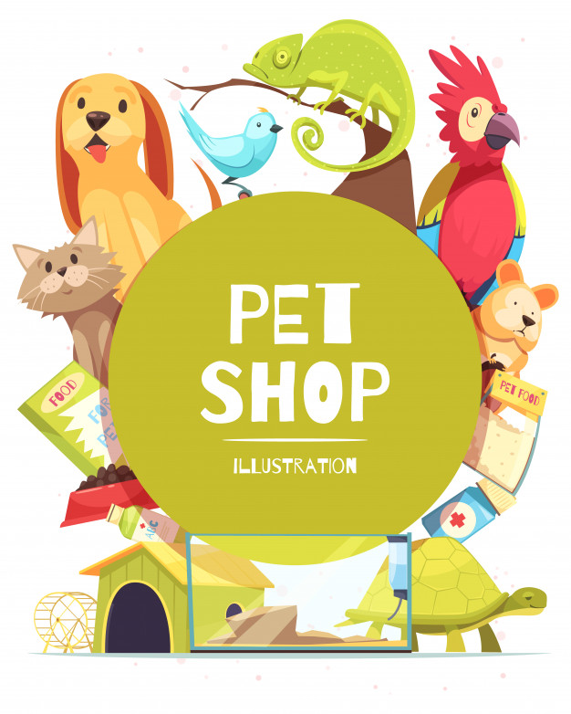

## API para cadastramento de estabelecimentos voltado aos cuidados dos animais. 

### Pofem ser cadastrados Pet Shop, Clínicas e Hospitais veterinários e Hospedagens (hoteis pet e creche).

<b>

## *Pet Shop*



<br>

### __Pet Shop__ são estabelecimentos comercial especializados em vender animais, geralmentes filhotes, mas a principal característica de um pet shop está na venda de insumos essenciais para pets - rações, areias higiênicas, remédios, shampoos, condicionadores, acessórios, roupinhas, entre outros. Também focam na prestação de servicos como banho e tosa.

<br><br>

## *Clínicas e Hostipais veterinários*


<br>

### __Clínicas e Hostipais veterinários__ ambos atuam no atendimento de animais domésticos e tem como obrigatoriedade: oferta de atendimento e consulta, aplicação de vacinas, capacidade de internação e tratamento clínico-cirúrgico que pode ser opcional, área de diagnóstico(radiologia, análise laboratoriais e ultrasonografia). A diferença entre é que as clínicas funcionam com horário restrito,ou seja, não há atendimento integral. Já os hospitais veterinários tem seu funcionamento integral, 24 horas por dia, ininterruptamente.

<br><br>

## *Hospedagem animal (Pet Hotel)*


<br>

### __Pet Hotel__ é um empreendimento que oferece serviços de hospedagem para pets. Tal um hotel para pessoas, outros serviços podem ser agregados, como acomodações com suítes privativas, camas confortáveis, espaços específicos de lazer, piscina e área de agility, serviços de higiene e beleza, serviços terapêuticos voltados à fisioterapia e à acuputura, dentre outros.Tudo isso para amenizar o sofrimento dos animais durante a ausência do dono e, principalmente, tranquilizar os donos, assegurando que seus bicinhos estão sendo bem cuidados neste período.  

<br><br>

## __Objetivos__
* ### Buscar estabelecimento por Id, Nome, Categoria e Bairro;

* ### Cadastro de um novo estabeleciemento pelo usuário;

* ### Atualizar um cadastro total;

* ### Poder atualizar partes do cadastro;

* ### Poder deletar um estabelecimento cadastrado.

<br><br>

## __Rotas__

<br>


<br>

### [GET]  _"/petshop/todos"_  -- Busca e retorna todos os estabelecimentos cadastrados;
<br>

### [GET]  _"/petshop/nome"_ -- Busca e retorna um estabelecimento pelo nome;
<br>

### [GET]  _"/petshop/categoria"_ -- Busca e retorna os estabelecimentos por categoria ;
<br>

### [GET]  _"/petshop/bairro"_ -- Busca e retorna os estabelecimentos pelo bairro ;
<br>

### [GET]  _"/petshop/:id"_ -- Busca e retorna um estabelecimento pelo ID;
<br>

### [POST]  _"/petshop/criar"_ -- Cadastra um nome estabelecimento;
<br>

### O deve ser retornado:
```
{
    id: Numero Gerado Automaticamente,
    nome: "String",
    site: "String",
    categoria: "String",
    logradouro: "String",
    numero: Numero Inteiro,
    bairro: "String",
    cidade: "String",
    estado: "String",
    telefone: "String"
}
```
<br>

### [POST] _"/petshop/:id/like"_ -- Atribui like ao estabelecimento selecionado pelo ID;
<br>

### [PUT]  _"/petshop/:id"__ -- Atualiza todos os campos;
<br>

### [PATCH]  _"/petshop/:id"_ -- Atualiza qualquer campo do cadastro;
<br>

### [DELETE]  _"/petshop/:id"_ -- Deleta um estacionamento cadastrado.


